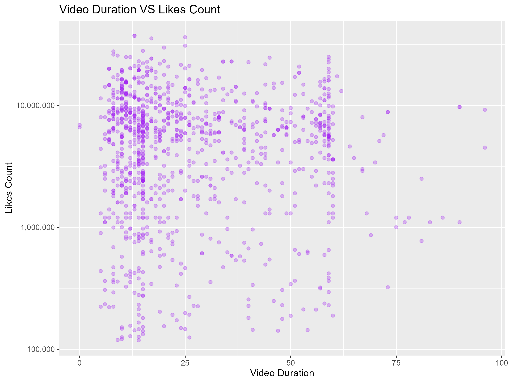

# tiktok-general-content-insights

## Overview
This project explores engagement patterns in general TikTok content by analyzing how factors like video duration, posting time, hashtag usage, verification status, and audio type influence likes, views, comments, and shares.

The dataset focuses exclusively on **popular content (≥ 100,000 likes)** to surface meaningful insights about what drives performance on the platform.

The analysis aims to answer questions like:
- Do verified accounts consistently perform better?
- How does posting time influence likes?
- Is there a relationship between likes, views, comments, and shares?
- Does hashtag count or music type impact performance?
- What is the relationship between video duration and engagement?

## Data Source
- File: tiktok_dataset.xlsx

- Source: General TikTok data collection across various content types (no niche focus)

- Data includes:
  - Engagement metrics: likes, views, comments, shares
  - Video metadata: duration, posting time, hashtags, music type
  - Author metadata: follower count, verification status

## Tools Used
| Tool | Purpose |
|------|---------|
| R | Data analysis & visualization |
| tidyverse | Data wrangling (dplyr, stringr, ggplot2) |
| lubridate | Date/time processing |
| readxl | Excel file import |
| scales | Cleaner axis labelling in visualizations |
| ggplot2 | Data visualization |

## Data Preparation & Cleaning
✅ Steps Taken:
1. Column Selection: Extracted relevant columns for user, video, engagement, and hashtags.
2. Renaming for Clarity: Cleaned column names to intuitive, standardized terms (e.g., authorMeta/digg → total_likes).
3. Cleaning Actions:
   - Converted timestamps from ISO 8601 to POSIXct for date analysis.
   - Categorized verification into "Verified" / "Not Verified".
   - Counted number of hashtags in each caption.
4. Data Filtering:
   - Excluded videos longer than 100 seconds.
   - Focused only on high-engagement posts (≥ 100,000 likes).
   - Removed outliers with > 25 hashtags to avoid skew.
   - Dropped rows with missing critical data.
5. Feature Engineering:
   - Extracted weekday and hour posted from timestamps.

## Analysis Conducted
📈 Correlation Exploration:
- Likes vs. Plays: Strong positive relationship on log scale.
- Likes vs. Shares: Positive correlation; viral content gets shared.
- Comments vs. Likes: Higher comments align with higher likes, indicating comments drive reach.

📅 Temporal Trends:
- Weekday Patterns: Median likes analyzed by weekday.
- Hour of Day: Median likes compared across hours posted.

🎬 Content Attributes:
- Video Duration: Shorter videos generally trend towards higher likes.
- Verification Status: Verified creators tend to achieve higher median likes.
- Original Music Usage: Slightly less engagement than trending sounds.

🔖 Hashtag Strategy:
- Hashtag Count vs. Likes: Higher counts show diminishing returns past a threshold.
- Top First Hashtags: Identified hashtags associated with higher median views.

## Visualizations Created
| Visualization	| Purpose | Link |
|---------------|---------|------|
| Likes vs. Plays (log-log scale)	| Validate correlation between metrics |  |
| Likes vs. Shares (log-log scale) | Explore engagement behavior |  |
| Verification vs. Likes (boxplot) |	Understand impact of verification |  |
| Video Duration vs. Likes (scatter) |	Explore content length performance |  |
| Weekday vs. Median Likes (bar chart) |	Optimize posting days |  |
| Hour Posted vs. Median Likes (bar chart) | Optimize posting times |  |
| Hashtag Count vs. Likes (scatter) |	Assess effect of hashtag volume |  |
| Comments vs. Likes (log-log scale) |	Engagement's influence on likes |  |
| Original Music vs. Likes (boxplot) |	Analyze music choices |  |
| Top 10 Hashtags by Views (bar chart) |	Identify effective hashtags |  |

## Key Insights
Engagement Patterns
- Likes, plays, and shares are strongly interrelated. High engagement cascades across metrics.
- Comments strongly correlate with higher likes, affirming their value to TikTok’s algorithm.

Timing Strategy
- Evening hours (7PM–9PM) consistently show higher median likes.
- Some weekdays outperform others slightly, though effect size varies.

Content Strategy
- Videos under ~30-60 seconds perform best for likes.
- Verified accounts outperform non-verified accounts on average, though exceptions exist.
- Trending audio outperforms original music for driving reach.

Hashtag Strategy
- Strategic hashtags tied to specific communities or trends outperform generic ones.
- Overuse (> 15-20 hashtags) offers diminishing returns.

## Potential limitations

| Limitation | Why it Matters |
|------------|----------------|
| Sample Bias	| Focus on high-performing posts (≥ 100K likes); results may not generalize to smaller accounts. |
| No Niche Segmentation |	Trends may differ across niches (comedy vs. education vs. lifestyle). |
| Temporal Snapshot	| TikTok's algorithm evolves rapidly; these trends reflect this dataset’s timeframe only. |
| Surface-Level Engagement Metrics | Does not analyze deeper creative variables (e.g., humor, storytelling). |

## Recommendations
✅ Post during evening hours for optimal engagement.

✅ Encourage comments and shares to amplify content reach.

✅ Use targeted, relevant hashtags sparingly but strategically.

✅ Trending sounds outperform original music for maximizing reach.

✅ Verification status helps, but quality content can still go viral.

## Conclusion
This project provides a data-driven perspective on what influences TikTok engagement across general content. While patterns like posting time, content length, and engagement strategies align with broader platform trends, the project highlights the importance of strategic posting and authentic engagement over mere volume metrics.

